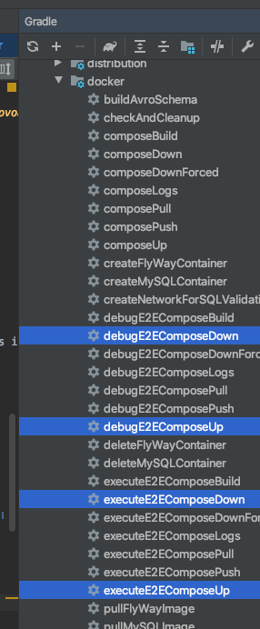
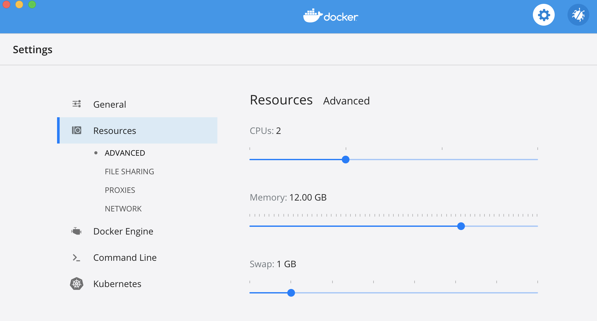
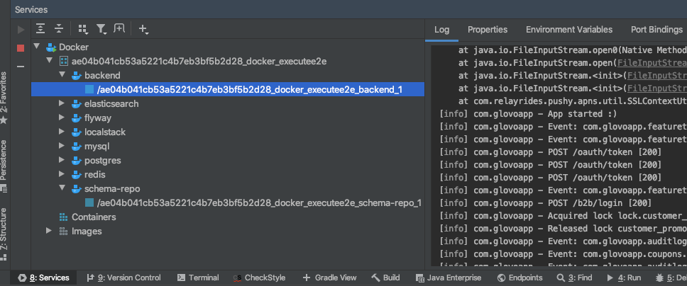

# Description
Dockers files to generate images from the CI, when the code changes.

# Configuration
## IntelliJ config
- Add __Cucumber for Java__ plugin to IntelliJ. Once installed, you should be able to navigate from a feature to its implementation. See [Cucumber for Java plugin](https://www.jetbrains.com/help/idea/bdd-frameworks.html)
- Add __Docker__ plugin. Follow [Docker plugin](https://www.jetbrains.com/help/idea/docker.html)
To take advantage of the plugin, configure it like in the below image:
<p align="center">

</p>

## Docker Congfig
- Add more Memory
<p align="center">

</p>

### Clean Local environment

- To stop/remove all Docker containers:
```
docker stop $(docker ps -a -q)
docker rm $(docker ps -a -q)
```

- To clean up your system see https://docs.docker.com/config/pruning/, some samples:
```
docker system prune
docker images purge
docker volume prune
```

## Logs
- See Backend logs, when Backend is executed inside a Docker:
<p align="center">

</p>
